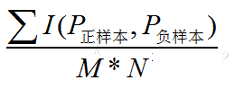
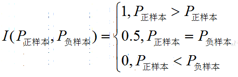

## 模型评估

### AUC
#### 1、 AUC的含义和计算方式 [参考](https://blog.csdn.net/luo3300612/article/details/80367901)
含义：
AUC直观意义是ROC曲线围成的面积。提到AUC应该从混淆矩阵说起，具体的就是4中结果类别，即TP FN FP TN 分别为 预测为正样本 实际为正样本、预测为负 实际为正、预测为正实际为负、预测为负实际为负。
对于二分类问题我们会设计阈值进行分类，基于混淆矩阵和二分了方法，可以在测试集上绘画ROC曲线。我们需要在测试集上计算真正例率TPR和假正例率FPR。
$$TPR = \frac{TP}{TP+FN}$$
$$FPR = \frac{FP}{FP+TN}$$
TPR指的是所有正样本中被模型预测为正样本的占比率。FPR指在所有反例中被模型误判为正样本的占比率。TPR等同于召回率。对于ROC曲线的绘画是以FPR为横坐标，TPR为纵坐标。对于不同阈值，得到多组
(FPR,TPR)，画在坐标轴上得到ROC曲线。
AUC的全称是Area under the Curve of ROC。AUC是ROC曲线和x轴围成的面积，越大说明分类的效果越好。

计算方式：[参考](https://blog.csdn.net/qq_22238533/article/details/78666436)
1、在有M个正样本,N个负样本的数据集里。一共有M*N对样本（一对样本即，一个正样本与一个负样本）。统计这M*N对样本里，正样本的预测概率大于负样本的预测概率的个数。

2、利用下面的公式：[公式的解释](https://blog.csdn.net/pzy20062141/article/details/48711355)

#### 2、数据不平衡，auc和pr曲线如何选
#### 3、 auc和pr在推荐之中的偏好（auc偏向于降低推荐用户不喜欢的内容，pr偏向于提高推荐用户喜欢的内容）
#### 4、 回归、分类用到的评价函数，为什么用。说准确率，AUC。
#### 5、 常见的评价指标有哪些；ROC 曲线 (0,0) (0,1) (1,0) (1,1) 四个点的含义
(0,0)表示TP、FP都为0 表示模型预测的结果都是负样本(阈值为1)
(0,1)表示FN为0，FP为0 模型预测为正其实为负，模型预测为负其实为正，说明模型结果最不好
(1,0)表示TN为0，TP为0 模型预测为负实际为负，模型预测为正实际为正，表示模型预测结果非常好，都预测对了。
(1,1)表示FN、TN都为0 表示模型预测的结果都为正样本(阈值为0)

#### 6、 AUC Recall 等评价指标
#### 7、 CTR损失函数及意义
#### 8、 CTR评价指标，AUC意义
AUC的意义：
1、AUC反应的是分类器对样本的排序能力。如果我们完全随机的对样本分类，那么AUC应该接近0.5。
2、AUC对样本类别是否均衡并不敏感，这也是不均衡样本通常用AUC评价分类器性能的一个原因。
举例：在一个数据不平衡的场景中，如果正样本的比例很小0.1%，那么模型预测所有样本都是负样本，那么模型的准确率为99.9%。
但是使用AUC的话，模型预测所有样本都是负样本，那么TP、FP都为0，那么AUC为0.5。这样就可以避免数据分布不均带来的问题。

#### 9、 介绍下AUC和F1-score
AUC介绍同第一个问题。

#### 10、 召回率、准确率

#### 11、 常用的模型评估指标有哪些，也问到了对AUC的理解；

