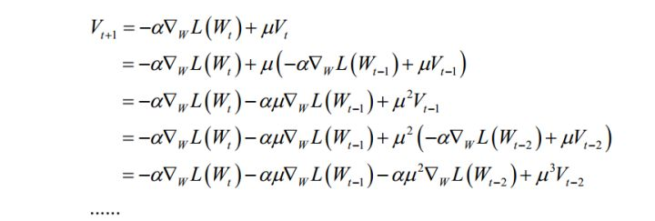

## 深度学习之优化方法

* 学习率的自动学习 Adam AdaGrad  RMSprop [参考](https://blog.csdn.net/weixin_37352167/article/details/90273820)
为了稀疏特征的训练，采用自适应学习率

AdaGrad 核心是加入一个正则化因子，使得数据较为稀疏的特征梯度变大，在数据稠密的特征的梯度减小，对于不同参数自动改变梯度的大小。
正则化作出的处理是 **前 t 次迭代的梯度的平方进行求和，ε表示一个无穷小量，为了防止分母为 0；**

**对于数据稀疏的特征来讲，参数每次迭代更新的梯度始终非常小，几乎为 0，那么之前轮次的梯度的和依然很小，当 μ 除以一个很小的数时值会得到放大，那么此时他的学习速率就变大了。**
**对于数据稠密的特征来讲，参数每次迭代更新的梯度较大，那么之前轮次的梯度的和会较大，当 μμ 除以一个较大的数时值会得到缩小，那么此时他的学习速率就变小了。**
所以他可以对于不同的参数以不同的学习速率进行更新，得到了自适应的效果。  **不理解的可以点击参考  看里面的公式就理解了**
缺点：分母为前几次的累加和，那么在经过一定次数的迭代后分母的值会变的较大，不管是对于稀疏还是稠密的特征，它们的学习速率都会变得很小，会使得更新速度停滞，不得不提前结束训练。

RMSprop 是对AdaGrad的改进，将AdaGrad问题中的**前 t 次迭代的梯度的平方进行累加**改成了 **前 t 次迭代的梯度的均方根进行累加**
均方根的增长速度要比梯度累加要慢，所以可以进行更多次的迭代，不至于早早结束训练。 **可以点击参考  参考里面的公式**

**Adam  这种方法像是 RMSprop + Momentum（难  后续补充）**

* SGD
SGD  随机梯度下降，优化思想是用当前位置负梯度方向作为搜索方向，因为该方向为当前位置的最快下降方向，所以也被称为是”最速下降法“。最速下降法越接近目标值，步长越小，前进越慢。

缺点：
  1）靠近极小值时收敛速度减慢，因为越靠近极小值，参数的权重更新量越小
  2）特征没做归一化，不同量纲导致的梯度更新量差别大，迭代过程中容易偏来偏去的
  3）梯度下降法在接近最优解的区域收敛速度明显变慢，利用梯度下降法求解需要很多次的迭代。

批量梯度下降法（Batch Gradient Descent，BGD）
计算每个参数theta的梯度，以按每个参数theta的梯度负方向，来更新每个theta。这样会得到一个全局最优解
缺点：每迭代一步，都要用到训练集所有的数据，如果m很大，那么可想而知这种方法的迭代速度会相当的慢。

随机梯度下降（Stochastic Gradient Descent，SGD）
随机梯度下降是通过每个样本来迭代更新一次，如果样本量很大的情况（例如几十万），那么可能只用其中几万条或者几千条的样本，就已经将theta迭代到最优解了，
对比上面的批量梯度下降，迭代一次需要用到十几万训练样本，一次迭代不可能最优，如果迭代10次的话就需要遍历训练样本10次。
**但是，SGD伴随的一个问题是噪音较BGD要多，使得SGD并不是每次迭代都向着整体最优化方向（确切一些说 sgb更容易带来极值附近的震荡）。**
**两者的关系可以这样理解：随机梯度下降方法以损失很小的一部分精确度和增加一定数量的迭代次数为代价，换取了总体的优化效率的提升。增加的迭代次数远远小于样本的数量。**

**批量梯度下降---最小化所有训练样本的损失函数，使得最终求解的是全局的最优解，即求解的参数是使得风险函数最小，但是对于大规模样本问题效率低下。**

**随机梯度下降---最小化每条样本的损失函数，虽然不是每次迭代得到的损失函数都向着全局最优方向， 但是大的整体的方向是向全局最优解的，最终的结果往往是在全局最优解附近（小样本可能导致不精确，大样本差别不是很大），适用于大规模训练样本情况。**

* 带动量的SGD (Momentum)

这是对SGD的一个改进，SGD最大的问题就是在最优值出震荡，因此为了减小震荡，加入了动量项。动量项累积了之前迭代的梯度值，加上动量项之后的公式为：
$$W_{t+1} = W_t + V_{t+1}$$
其中$V_{t+1}$是动量项，代替了之前的梯度，具体的公式为：
$$V_{t+1} = - \alpha \deta_w L(W_t) + μV_t$$
它是上一时刻的动量项与本次梯度值的加权平均值，其中 α是学习率， μ是动量项系数。如果按照时间t进行展开，则第t次迭代时使用了从1到t次迭代时的所有梯度值，
且老的梯度值 μ^t 的系数指数级衰减：

**动量项累积了之前迭代时的梯度值，使得本次迭代时沿着之前的惯性方向向前走。**

