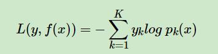
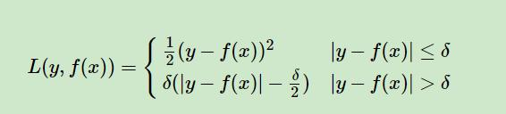

## 决策树之GDBT

### 概述
在GDBT中，假设我们前一轮迭代学习到的强学习器是$f_{t-1}(x)$,损失函数是$L(y,f_{t−1}(x))$,那么本轮的目标是为了学习到一个
弱学习器$h_t(x)$让本轮的损失函数$L(y,f_{t}(x))=L(y,f_{t−1}(x)+h_t(x))$最小。也就是说，本轮迭代找到决策树，要让样本的损失尽量变得更小。

### GBDT的负梯度拟合

对于GBDT回归算法，其就是按照上面的负梯度拟合进行的，但是对于GBDT分类算法也是按照负梯度拟合进行，但是由于值不具备连续性，而是离散型
导致我们无法直接从输出类别去拟合类别输出的误差。

主要有两个方法：
一个是用指数损失函数，此时GBDT退化为Adaboost算法。
另一种方法是用类似于逻辑回归的对数似然损失函数的方法。也就是说，我们用的是类别的预测概率值和真实概率值的差来拟合损失。

本文仅讨论用对数似然损失函数的GBDT分类。而对于对数似然损失函数，我们又有二元分类和多元分类的区别。

### GBDT常用损失函数
对于分类算法，其损失函数一般有对数损失函数和指数损失函数两种:
1、如果是指数损失函数，则损失函数表达式为 ： L(y,f(x))=exp(−yf(x))  GDBT此时退化成Adaboost
2、如果是对数损失函数，分为二元分类和多元分类两种
二分类：

多分类：

对于回归算法，其损失函数一般有四种:
1、均方差，这个是最常见的回归损失函数了

2、绝对损失，这个损失函数也很常见

对应负梯度误差为：sign(yi−f(xi))

3、Huber损失，它是均方差和绝对损失的折衷产物，对于远离中心的异常点，采用绝对损失，而中心附近的点采用均方差。

对应的负梯度误差为：

4、分位数损失。它对应的是分位数回归的损失函数，表达式为

对于后两者的损失函数主要是为了平衡异常值的出现，提高模型的健壮性而设计。

### GBDT的正则化
1、在每个弱学习器上设置一个步长v。

步长的取值范围在(0,1]之间。于同样的训练集学习效果，较小的ν意味着我们需要更多的弱学习器的迭代次数。通常我们用步长和迭代最大次数一起来决定算法的拟合效果。

2、通过子采样比例（subsample）。取值为(0,1]。这里的采样是不放回采样。
选择小于1的比例可以减少方差，即防止过拟合，但是会增加样本拟合的偏差，因此取值不能太低。

3、对CART回归树进行正则化剪枝。

### GBDT小结
GBDT主要的优点有：
1) 可以灵活处理各种类型的数据，包括连续值和离散值。
2) 在相对少的调参时间情况下，预测的准确率也可以比较高。这个是相对SVM来说的。
3）使用一些健壮的损失函数，对异常值的鲁棒性非常强。比如 Huber损失函数和Quantile损失函数。
GBDT的主要缺点有：
1)由于弱学习器之间存在依赖关系，难以并行训练数据。不过可以通过自采样的SGBT来达到部分并行。
 
 ## 问题：
1. GBDT中的“梯度提升”，怎么理解？和“梯度下降”有啥异同？
2. GBDT的原理，
3. GDBT为什么拟合上一次的负梯度：
	简单来讲就一句话，**为了可以扩展到更复杂的损失函数中。**
	这时候你可能就有疑问了，难道不是所有的损失函数都在 $\haty = y$ 时最小吗？
	
	那可能你忘了正则项这一回事，如果只是经验风险最小化的话非常容易过拟合，所以一个合理的办法就是在每个基模型中加入正则项，
	所以在有正则项的情况下就不再是 $\haty = y$ 时损失函数最小了，所以我们需要计算损失函数的梯度，而不能直接使用分模型来拟合残差。
	
	下面是我对上面的理解：
	有正则化项的时候我们需要拟合负梯度，我们可以把损失函数看做是$\LARGE F_m$的函数，当$\LARGE F_1$的时候损失函数较大，
	那么下一步$\LARGE F_2$就是拟合损失函数对$\LARGE F_1$负梯度，那么$\LARGE F_2+F_1$相当于$\LARGE F_m$又向负梯度方向走了一步，
	相当于每次只沿着负梯度方向走一个步长，得到新的提升树，新的提升树在之前提升树的基础上向负梯度方向走了一步，更加减小了损失函数，
	所以每个新的提升树，拟合的都是损失函数对之前提升树的负梯度方向。
	
	我们要拟合损失函数的负梯度，可以看做拟合一个方向为负梯度方向，步长为单位长度的值，所以拟合的过程相当于我们沿着负梯度方向走了一个步长，
	具体走多少步（多少步可以理解为训练多少个决策树来拟合该分类器，使得损失函数最低）达到终止的条件，即走到最优点的附近。
	
	我的理解是：
	对于提升树来说，我们可以通过拟合其残差来减小损失。但是这仅仅是对于损失函数是MSE的情况，这时候很巧的是其负梯度方向刚好等于残差值，因此对于
	不同的损失函数，就不一定是拟合其残差值，因此这就解释了什么叫 **“为了可以扩展到更复杂的损失函数中”**
	
	其次每次用cart树拟合负梯度才是更加广义上的拟合项，更具普适性。如果将拟合函数通过泰勒公式展开时，可以发现负梯度时其目标函数下降最快的方向。
	**梯度的本质也是一种方向导数，综合了各个方向（参数）的变化，选择了一个总是最优（下降最快）的方向；**
	因此对于boosting其实是通过弱学习器拟合梯度，并不是拟合残差。因为boosting的目的是为了损失函数最小化，而不是更好的拟合训练数据，因此
	需要拟合梯度。
	
	
