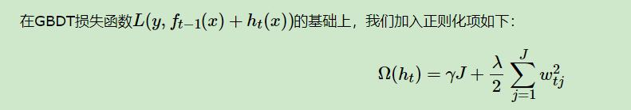
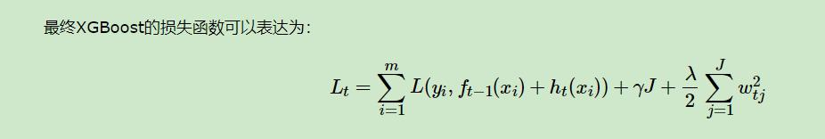
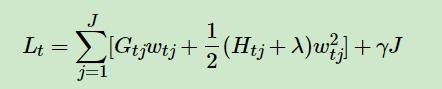
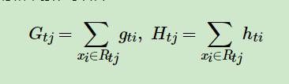
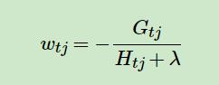
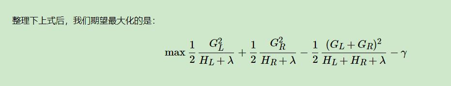
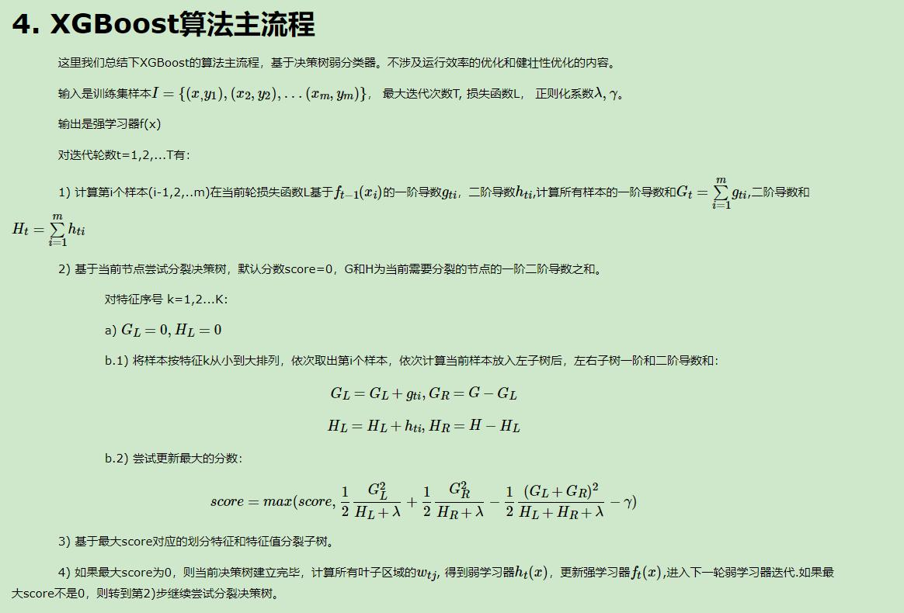

## 决策树之XGboost

### 从GBDT到XGBoost
1、算法本身的优化
	1）学习器的选择，对比GBDT只支持决策树来说，还可以支持很多其他弱学习器。
	2）在损失函数上，除了本身的损失，还加上了正则化部分。
	3）优化方式上，GBDT的损失函数只对误差部分做负梯度（一阶泰勒）展开，而XGBoost损失函数对误差部分做二阶泰勒展开，更加准确。
2、算法运行效率的优化
	对于每个弱学习器，比如决策树建立的过程做并行选择，找到合适的子树分裂特征和特征值。在并行选择之前，先对所有的特征的值进行排序分组，
	方便前面说的并行选择。
3、算法健壮性的优化
	1）对于缺失值的特征，通过枚举所有缺失值在当前节点是进入左子树还是右子树来决定缺失值的处理方式。
	2）加入L1和L2正则化，防止过拟合

### XGBoost损失函数
对于GBDT的求解过程，需要解决当前决策树最优的所有J个叶子节点区域和每个叶子节点区域的最优解$c_tj$。
GBDT采样的方法是分两步走，先求出最优的所有J个叶子节点区域，再求出每个叶子节点区域的最优解。

XGBoost的损失函数的形式。

这里的J是叶子节点的个数，而wtj是第j个叶子节点的最优值。这里的wtj和我们GBDT里使用的ctj是一个意思，
只是XGBoost的论文里用的是w表示叶子区域的值。

最终我们要极小化上面这个损失函数，得到第t个决策树最优的所有J个叶子节点区域和每个叶子节点区域的最优解wtj。

不同：
XGBoost没有和GBDT一样去拟合泰勒展开式的一阶导数，而是期望直接基于损失函数的二阶泰勒展开式来求解。

因此通过二阶展开式的损失函数的最终表示：

可以参考[刘建平](https://www.cnblogs.com/pinard/p/10979808.html)博客的推导过程

### XGBoost损失函数的优化求解
对于一次性求出损失函数的最优解，可以分为2个子问题
1) 如果我们已经求出了第t个决策树的J个最优的叶子节点区域，如何求出每个叶子节点区域的最优解wtj？
我们直接基于损失函数对wtj求导并令导数为0即可。这样我们得到叶子节点区域的最优解wtj表达式为：

其实这个过程已经在GBDT中已经提出过了，可以参考刘建平老师的博客

2) 对当前决策树做子树分裂决策时，应该如何选择哪个特征和特征值进行分裂，使最终我们的损失函数Lt最小？
在GBDT里面，我们是直接拟合的CART回归树，所以树节点分裂使用的是均方误差。XGBoost这里不使用均方误差，
而是使用贪心法，即每次分裂都期望最小化我们的损失函数的误差。

就是将

带入到损失函数即可，

什么意思呢，就是在分裂子树的过程中，通过不断计算不同的分裂节点，可以得到GL和HL的值，这样最大化上述式子的结果，则可以确定分裂子树的点。
这不同于GBDT中通过均方差来寻找分裂点。

### 主要流程

### XGBoost算法运行效率的优化
**运行效率的优化**
1、Boosting算法的弱学习器是没法并行迭代的，但是单个弱学习器里面最耗时的是决策树的分裂过程，XGBoost针对这个分裂做了比较大的并行优化。
	对于不同的特征的特征划分点，XGBoost分别在不同的线程中并行选择分裂的最大增益。
	
2、对训练的每个特征排序并且以块的的结构存储在内存中，方便后面迭代重复使用，减少计算量。
	首先默认所有的样本都在右子树，然后从小到大迭代，依次放入左子树，并寻找最优的分裂点。这样做可以减少很多不必要的比较。

**健壮性的优化**
1、加入正则化的方式，提高其泛化能力

2、**XGBoost没有假设缺失值一定进入左子树还是右子树，则是尝试通过枚举所有缺失值在当前节点是进入左子树，还是进入右子树更优来决定一个处理缺失值默认的方向，这样处理起来更加的灵活和合理。**

1. XGboost 的节点分裂时候，依靠什么？数学形式？XGboost 比GBDT好在哪？
	通过贪心的思想，使得每次分裂子树的时候期望值最小化损失函数的误差，
	
2. xgb和lgb的区别
3. xgboost和lightgbm的区别
	还没看过lightgbm
	
4. 对xgboost的了解
	
5. xgboost的二阶泰勒展开为啥那么效果更好，
	1、因为对于MSE来说其二阶展开是一种很好的形式(一阶+二阶)，但是对于其他损失函数(logloss)来说就没这么好了，因此为了统一都采用
	泰勒公式的二阶展开式。简而言之：就是为了统一损失函数求导形式以满足自定义的损失函数。
	
	2、二阶泰勒展开本身对于梯度的收敛更快更准确。因为从二阶导本身的性质来说，一阶导数简单的认为是梯度方向，二阶导则是指引梯度方向如何变化
	
6. 高维稀疏的特征为啥不适合用xgboost
	因为树模型在训练过程中是一个贪心思想选择特征的过程，需要寻找一个分裂后信息增益最大的特征进行分类。如果使用高维稀疏特征，会使得子树的
	数量增多，计算量增大，导致模型的训练过程费时。
	
	除此之外由于高维稀疏特征对于树模型来说更容易发生过拟合的情况，因为对于树模型来说，我们的
	正则项通常是树的叶子和树的深度，但是对于高维稀疏特征，也只需要一个节点就可以分裂，惩罚不够，而对于线性模型，正则项通常是对权重W进行惩罚，
	因此对于每个维度可以进行控制，这样可以控制权重的大小。

7. XGBoost为什么使用泰勒二阶展开
	精准性：相对于GBDT的一阶泰勒展开，XGBoost的二阶泰勒展开可以更加精准的逼近真实的损失函数
	可扩展性：损失函数可以支持自定义函数，只需要新损失函数二阶可导
	
8.  XGBoost为什么可以并行训练
	这里的并行不是指每棵树可以并行训练，因为XGB采用的仍然是boosting思想，每棵树之间的训练只能采用线性的顺序。
	
	这里的并行指的是特征维度的并行：在训练之前，每个特征会按照特征值对样本进行预排序，并且按照Block结构进行存储，这方便后面查找特征的
	分割点时可以重复使用。并且在多个特征在寻找分割点的时候可以多线程并行计算。
	
9. XGBoost为什么快
	分块并行：在训练前会对每个特征值按照排序并存储为Block结构，支持后面特征分裂查找的重复使用，并且支持并行查找每个特征的分割点。
	
	CPU cache 命中优化： 使用缓存预取的方法，对每个线程分配一个连续的buffer，读取每个block中样本的梯度信息并存入连续的Buffer中。
	
	Block 处理优化：Block预先放入内存；Block按列进行解压缩；将Block划分到不同硬盘来提高吞吐
	
	
10. XGBoost防止过拟合策略
	1、目标函数的正则项：叶子节点个数+叶子节点权重的L1正则项+叶子节点权重的L2正则项
	2、列抽样：训练的时候采用部分的特征
	3、子采样：每轮的训练不适用全部的样本，使算法更加保守
	4、early stopping：经过多次迭代之后再验证集上改善性能，停止训练过程。
	5、shrinkage：对于每个树加上学习率，通过调整学习率来控制树的数量，为之后的训练留出足够的空间。
		
11. 使用XGBoost训练模型时，如果过拟合了怎么调参？
	1、控制模型的复杂度。包括max_depth,min_child_weight,gamma 等参数。(也就是对于每棵树进行控制)
	2、增加随机性，使得模型对于噪音节点不敏感。包括subsample,colsample_bytree。
	3、减小learning rate，但需要同时增加estimator 参数。
	
12. XGBoost怎么处理缺失值？
	- 在某列特征上寻找分裂节点时，不会对缺失的样本进行遍历，只会对非缺失样本上的特征值进行遍历，
		这样减少了为稀疏离散特征寻找分裂节点的时间开销。
	
	- 另外，为了保证完备性，对于含有缺失值的样本，会分别把它分配到左叶子节点和右叶子节点，
		然后再选择分裂后增益最大的那个方向，作为预测时特征值缺失样本的默认分支方向。
	
	- 如果训练集中没有缺失值，但是测试集中有，那么默认将缺失值划分到右叶子节点方向。

13. XGBoost中的一棵树的停止生长条件
	1、当新引入的一次分裂所带来的增益Gain<0时，放弃当前的分裂。这是训练损失和模型结构复杂度的博弈过程。
	2、由于每棵树的深度如果过大会导致模型过拟合，因此需要设置一个超参数max_depth来控制树的停止生长。
	3、当引入一次分裂后，重新计算新生成的左、右两个叶子结点的样本权重和。如果任一个叶子结点的样本权重低于某一个阈值，也会放弃此次分裂。
		这涉及到一个超参数:最小样本权重和，是指如果一个叶子节点包含的样本数量太少也会放弃分裂，防止树分的太细。
	
14. XGBoost如何选择最佳分裂点？
	XGBoost在训练前预先将特征按照特征值进行了排序，并存储为block结构，以后在结点分裂时可以重复使用该结构。
	
	因此，可以采用特征并行的方法利用多个线程分别计算每个特征的最佳分割点，根据每次分裂后产生的增益，最终选择增益最大
	的那个特征的特征值作为最佳分裂点。
	
	**如果在计算每个特征的最佳分割点时，对每个样本都进行遍历，计算复杂度会很大，这种全局扫描的方法并不适用大数据的场景。**
	**XGBoost还提供了一种直方图近似算法，对特征排序后仅选择常数个候选分裂位置作为候选分裂点，极大提升了结点分裂时的计算效率**
	
15. asd
16. sad
17. asd
18. as
19. das
20. d
21. asd
22. as
23. das
24. sad
25. asdasdasdas
26. dasdasd
27. asda
28. asd
29. asd
30. asda
31. sd
32. asd
33. as
34. das
35. d
36. asd
37. as
38. d
39. as
40. d
41. asd
42. as
43. d
44. as
45. d
46. asd
47. qw
48. ed
49. eqw
50. qwe
51. qwe
52. qwe
53. qw
54. e
55. sa
56. da
57. wed
58. w
59. dq
60. wd
61. we
62. rd
63. qwd
64. q
65. wd
